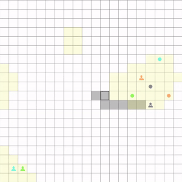

# Elevator in 2D

Elevator in 2D is a simulation of an elevator system within a grid-based environment. The objective of the elevator is  
to efficiently pick up and drop off passengers, while considering factors like passenger wait-time and distance.

## Demo

## Features

- **Grid-Based Environment:** The simulation is set in a grid-based environment where passengers are randomly spawned.

- **Passenger Placement:** Elevator in 2D employs the OpenSimplex noise algorithm to generate  
areas on the grid where passengers can be placed.
- **Pathfinding:** The elevator automatically moves towards the passenger with the highest priority.
- **Effiency Testing:** Allows tuning the pathfinding paramaters for improving elevator's effiency.
- **Custom Settings:** Custom control over the grid size, number of turns,
maximum passengers on board and probability of passenger spawning.

## Limitations
- **Capacity:** The elevator can pick up to one passenger at a time.
- **Number of elevators:** There is only one elevator. Addition of multiple elevators would require change  
of the pathfinding algorithm for optimized results.
- **Uniform passengers spawn:** The passengers spawn uniformly on the area they are allowed.  
A different approach is a use of a heatmap of spawn probabilities.

## Code Structure

### `main.py`
Initializes the game and graphics components, and runs the main game loop.

### `elevator_game.py`
Contains the core game logic, including classes for the elevator game, passengers, and elevator actions.

### `graphics.py`
Manages the graphical interface for the game, drawing the game board, passengers, and elevator.

### `location_randomizer.py`
Contains functions for choosing random cells on the grid. Used for controlling where passengers can spawn.

### `utils.py`
Contains utility functions used by the game logic.

### `distinctipy.py`

Generates distinct pastel colors used for graphical elements.

### `efficiency_testing.py`
Performs efficiency testing of multiple simulation runs.  
Contains functions for comparing the average total wait time of passengers over a game with n-turns of simulation  
with different pathfinding parameters.